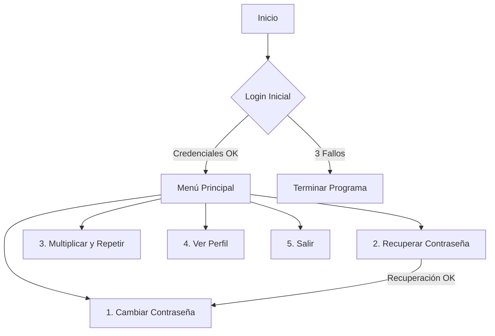

# 🔐 Sistema de Autenticación y Utilidades en C++


Este proyecto implementa un sistema de gestión de usuarios robusto (clase `Loger`) junto con utilidades matemáticas, demostrando conceptos fundamentales de Programación Orientada a Objetos (POO), validación de flujos y seguridad básica en C++.

---

## ✨ Características Principales

* 🛡️ **Login Seguro:** Sistema de autenticación con límite de 3 intentos fallidos.
* 🚑 **Recuperación de Cuenta:** Mecanismo de preguntas secretas (Security Questions) con normalización de texto (ignora mayúsculas/espacios).
* 🔄 **Gestión de Credenciales:** Funcionalidad para cambiar la contraseña de forma segura.
* 🔢 **Math Utils:** Herramienta para calcular $n = a \times b$ y repetir patrones de texto, con protección contra desbordamiento de buffer.

---

## 🚀 Instrucciones de Uso

### Pre-requisitos
Necesitas un compilador de C++ estándar (como G++, Clang o MSVC).

### 🛠️ Compilación
Para compilar el código, abre tu terminal y ejecuta:

```bash
g++ main.cpp -o sistema_auth
````

### ▶️ Ejecución

Una vez compilado, ejecuta el programa:

**En Windows:**

```bash
sistema_auth.exe
```

**En Linux/Mac:**

```bash
./sistema_auth
```

-----

## 🧠 Documentación del Código

### 1\. Clase `Loger` 👤

El corazón del sistema. Encapsula la lógica de seguridad.

| Método | Descripción |
| :--- | :--- |
| `login()` | Solicita credenciales. Retorna `true` si el acceso es concedido. Bloquea tras 3 fallos. |
| `recuperarContrasena()` | Valida identidad mediante `q1` y `q2`. Si es correcto, fuerza cambio de clave. |
| `cambiarContrasena()` | Pide nueva clave y confirmación. Valida que no estén vacías. |
| `mostrarPerfil()` | Muestra datos públicos (Usuario y Preguntas) sin revelar secretos. |
| `normalize(string)` | *Privado*. Limpia el texto (trim + lowercase) para comparaciones flexibles. |

### 2\. Utilidad `multiplicarYRepetir` ✖️

Función auxiliar fuera de la clase.

**Fórmula:**
Calcula las iteraciones usando $n = a \times b$.

**Validaciones:**

  * Protección contra entrada de letras en campos numéricos (`cin.clear`).
  * Límite de seguridad: `n <= 100000`.
  * Validación de signos: `n >= 0`.

-----

## 🗺️ Flujo de Ejecución

El programa sigue este ciclo de vida:



-----

## ⚠️ Notas de Seguridad (Disclaimer)

Este código es con fines **educativos**. Para un entorno de producción real, considera las siguientes mejoras:

1.  **Hashing:** Nunca almacenar contraseñas en texto plano (usar SHA-256 o bcrypt).
2.  **Persistencia:** Guardar los usuarios en una base de datos o archivo, no en variables volátiles.
3.  **Ocultamiento:** Usar librerías como `conio.h` o `termios` para mostrar asteriscos `***` al escribir la contraseña.