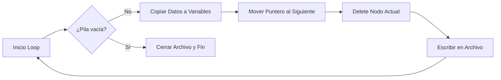

# 📚 Gestor de Cursos con Pila Dinámica (Stack) en C++


-purple.svg)


Este proyecto implementa una estructura de datos de tipo **Pila (Stack)** utilizando punteros y memoria dinámica para gestionar registros de estudiantes y cálculos de tiempo.

## ✨ Características Técnicas

* **Estructura LIFO:** El último registro en entrar es el primero en procesarse y guardarse.
* **Memoria Dinámica:** Uso eficiente de RAM mediante asignación (`new`) y liberación (`delete`) manual.
* **Cálculo de Tiempo:** Algoritmo de conversión: `(Semanas + Días + Horas) -> Segundos`.
* **Persistencia:** Exportación de la pila procesada a archivos de texto.

## 🚀 Instrucciones

### Compilación
Necesitas un compilador C++ estándar.

```bash
g++ main.cpp -o gestor_pila
````

### Ejecución

```bash
./gestor_pila
```

## 🛠️ Estructura del Código

### Definición del Nodo

El contenedor principal de la información:

```cpp
struct Nodo {
    Persona per;      // Datos del alumno
    Tiempo tem;       // Datos calculados
    Nodo* siguiente;  // Enlace al siguiente nodo
};
```

### Lógica del Vaciado de Pila

El programa extrae los datos siguiendo este ciclo hasta que la pila queda vacía:



## ⚠️ Notas sobre Entrada de Datos

  * **Cadenas:** El campo `curso` utiliza `cin >>`, por lo que no debe contener espacios (ej. usar `Programacion_1` en lugar de `Programacion 1`).
  * **Validación:** Los tiempos (semanas, días, horas) deben ser números positivos.
