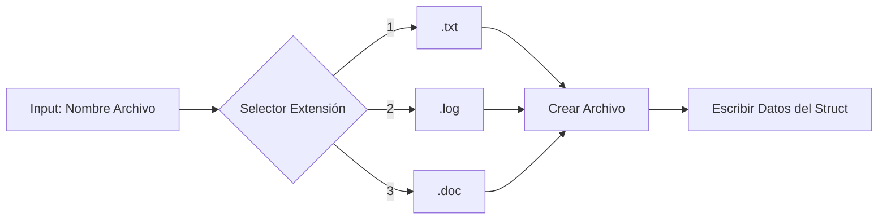

# 🗂️ Sistema de Registro y Calculadora Temporal en C++


Herramienta de consola para registrar estudiantes en cursos, generar archivos de respaldo y calcular la duración total del aprendizaje en segundos exactos.

## ✨ Características

* **Persistencia de Datos:** Genera archivos automáticamente con extensiones personalizables (`.txt`, `.log`, `.doc`).
* **Validación de Entrada:** Protege contra valores de tiempo negativos.
* **Precisión Matemática:** Conversión precisa de semanas a segundos utilizando tipos de datos extendidos (`long long`).
* **Estructuras:** Uso de `struct` para modelado de datos.

## 🚀 Instrucciones

### Compilación
```bash
g++ main.cpp -o registro_curso
````

### Ejecución

```bash
./registro_curso
```

## 🛠️ Funcionamiento Interno

### Flujo de Guardado de Archivos

El sistema construye el nombre del archivo dinámicamente:



### Lógica de Conversión

La función `resolver()` transforma el tiempo humano (Semanas/Días) a tiempo de máquina (Segundos):

| Input | Proceso | Output |
| :--- | :--- | :--- |
| Semanas | `* 7 + dias` | Días Totales |
| Días Totales | `* 24 + horas` | Horas Totales |
| Horas Totales | `* 3600` | **Segundos Totales** |

## 📄 Ejemplo de Salida (Archivo Generado)

Si el usuario elige la opción 1, se crea `archivo.txt` con este contenido:

```text
Nombre: Juan Perez
Cédula: 12345678
Curso: Programación Avanzada
```