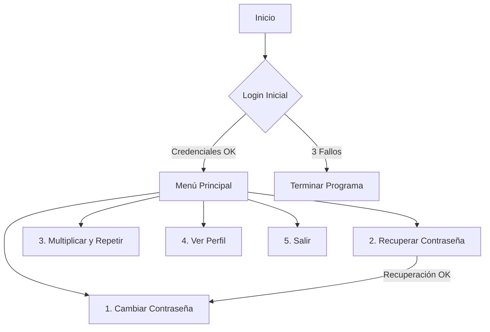
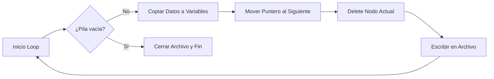
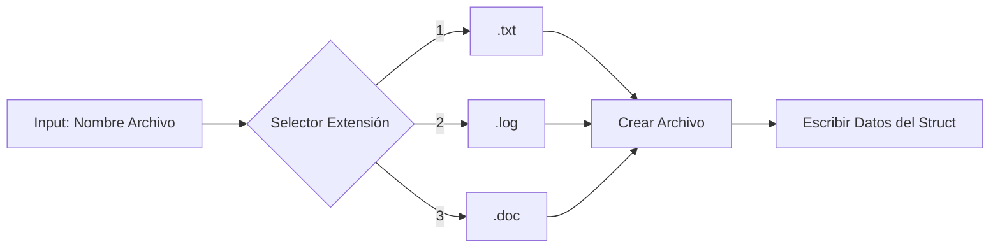

# AuthUtilsPOO_C++ - POO.md

# 🔐 Sistema de Autenticación y Utilidades en C++


Este proyecto implementa un sistema de gestión de usuarios robusto (clase `Loger`) junto con utilidades matemáticas, demostrando conceptos fundamentales de Programación Orientada a Objetos (POO), validación de flujos y seguridad básica en C++.

---

## ✨ Características Principales

* 🛡️ **Login Seguro:** Sistema de autenticación con límite de 3 intentos fallidos.
* 🚑 **Recuperación de Cuenta:** Mecanismo de preguntas secretas (Security Questions) con normalización de texto (ignora mayúsculas/espacios).
* 🔄 **Gestión de Credenciales:** Funcionalidad para cambiar la contraseña de forma segura.
* 🔢 **Math Utils:** Herramienta para calcular $n = a \times b$ y repetir patrones de texto, con protección contra desbordamiento de buffer.

---

## 🚀 Instrucciones de Uso

### Pre-requisitos
Necesitas un compilador de C++ estándar (como G++, Clang o MSVC).

### 🛠️ Compilación
Para compilar el código, abre tu terminal y ejecuta:

```bash
g++ main.cpp -o sistema_auth
````

### ▶️ Ejecución

Una vez compilado, ejecuta el programa:

**En Windows:**

```bash
sistema_auth.exe
```

**En Linux/Mac:**

```bash
./sistema_auth
```

-----

## 🧠 Documentación del Código

### 1\. Clase `Loger` 👤

El corazón del sistema. Encapsula la lógica de seguridad.

| Método | Descripción |
| :--- | :--- |
| `login()` | Solicita credenciales. Retorna `true` si el acceso es concedido. Bloquea tras 3 fallos. |
| `recuperarContrasena()` | Valida identidad mediante `q1` y `q2`. Si es correcto, fuerza cambio de clave. |
| `cambiarContrasena()` | Pide nueva clave y confirmación. Valida que no estén vacías. |
| `mostrarPerfil()` | Muestra datos públicos (Usuario y Preguntas) sin revelar secretos. |
| `normalize(string)` | *Privado*. Limpia el texto (trim + lowercase) para comparaciones flexibles. |

### 2\. Utilidad `multiplicarYRepetir` ✖️

Función auxiliar fuera de la clase.

**Fórmula:**
Calcula las iteraciones usando $n = a \times b$.

**Validaciones:**

  * Protección contra entrada de letras en campos numéricos (`cin.clear`).
  * Límite de seguridad: `n <= 100000`.
  * Validación de signos: `n >= 0`.

-----

## 🗺️ Flujo de Ejecución

El programa sigue este ciclo de vida:



-----

## ⚠️ Notas de Seguridad (Disclaimer)

Este código es con fines **educativos**. Para un entorno de producción real, considera las siguientes mejoras:

1.  **Hashing:** Nunca almacenar contraseñas en texto plano (usar SHA-256 o bcrypt).
2.  **Persistencia:** Guardar los usuarios en una base de datos o archivo, no en variables volátiles.
3.  **Ocultamiento:** Usar librerías como `conio.h` o `termios` para mostrar asteriscos `***` al escribir la contraseña.

---

# DSAStackQueueStu - pil_col.md

# Proyecto: Gestión de Estudiantes con Pila y Cola 🎓


## 📌 Descripción
Este programa en C++ permite registrar estudiantes y almacenarlos en dos estructuras:
- **Pila (stack)** → último en entrar, primero en salir.
- **Cola (queue)** → primero en entrar, primero en salir.

Cada estudiante tiene:
- Nombre y apellido
- Edad
- Nacionalidad
- Curso
- Promedio de tres notas (ponderado: 30%, 30%, 40%)

El sistema determina si el estudiante aprueba (≥10) o reprueba.

---

## ⚙️ Requisitos
- Lenguaje: C++ (versión 11 o superior recomendada)
- Librerías estándar: `<iostream>`, `<stdlib.h>`

---

## 🚀 Compilación y ejecución
```bash
g++ estudiantes.cpp -o estudiantes
./estudiantes
```

---

## 🧩 Estructura del código

`struct per`
- `nom`: nombre
- `ap`: apellido
- `age`: edad
- `contry`: nacionalidad

`struct estudiante`
- `pipol`: datos personales (per)
- `cur`: curso
- `prom`: promedio de notas

`struct Cont`
- Nodo que almacena un estudiante
- Puntero foll al siguiente nodo (para pila o cola)

**Funciones principales** 
- `float prom(float, float, float)`
  Calcula promedio ponderado de tres notas.
- `bool aprob(estudiante)`
  Retorna true si el promedio ≥ 10.
- `sozoPhill(...) / hakaiPhill(...)`
  Insertar y extraer estudiantes de la pila.
- `sozoCoil(...) / hakaiCoil(...)`
  Insertar y extraer estudiantes de la cola.

`int main()`
- Muestra menú principal:
  1. Ingresar y sacar pila
  2. Ingresar y sacar cola
  3. Salir
- Permite ingresar múltiples estudiantes.
- Al finalizar, muestra y vacía la pila o cola.

---

## 🧪 Ejemplo de uso

**Entrada (usuario)**

```
MENU
1. Ingresar y Sacar pila
2. Ingresar y Sacar cola
3. Salir
Seleccione opción: 1
Ingrese nombre de la persona:
Juan
Ingrese apellido de la persona:
Pérez
Ingrese nacionalidad de la persona:
Venezolana
Ingrese edad de la persona:
20
Ingrese el curso del estudiante:
Matemáticas
Ingrese la nota 1:
12
Ingrese nota 2:
14
Ingrese nota 3:
15
El estudiante aprobo
¿Ingresar más datos? (s/n):
n
```

**Salida en consola**

```
Estudiantes en la pila:
Nombre y Apellido: Juan Pérez
Edad: 20
Nacionalidad: Venezolana
Curso: Matemáticas
Promedio: 13.9 - Aprobado
```

---

## 📌 Notas
- Usar `std::stack` y `std::queue` en lugar de punteros manuales.  
- Validar entradas (notas entre 0–20, edad positiva).  
- Evitar system("cls") por ser dependiente de Windows.  
- Modularizar en clases `(GestorEstudiantes)`.  
- Estandarizar nombres de funciones y variables.  
- Este programa es un buen ejemplo de estructuras dinámicas (pila y cola) implementadas manualmente.  
- Demuestra el uso de punteros y memoria dinámica en C++.  
- Puede servir como base para sistemas más grandes de gestión académica.  
- En aplicaciones reales se recomienda usar estructuras estándar `(std::stack, std::queue)` y manejo de excepciones.


---

# DS_Stack_IO - tempila.md

# 📚 Gestor de Cursos con Pila Dinámica (Stack) en C++


-purple.svg)


Este proyecto implementa una estructura de datos de tipo **Pila (Stack)** utilizando punteros y memoria dinámica para gestionar registros de estudiantes y cálculos de tiempo.

## ✨ Características Técnicas

* **Estructura LIFO:** El último registro en entrar es el primero en procesarse y guardarse.
* **Memoria Dinámica:** Uso eficiente de RAM mediante asignación (`new`) y liberación (`delete`) manual.
* **Cálculo de Tiempo:** Algoritmo de conversión: `(Semanas + Días + Horas) -> Segundos`.
* **Persistencia:** Exportación de la pila procesada a archivos de texto.

## 🚀 Instrucciones

### Compilación
Necesitas un compilador C++ estándar.

```bash
g++ main.cpp -o gestor_pila
````

### Ejecución

```bash
./gestor_pila
```

## 🛠️ Estructura del Código

### Definición del Nodo

El contenedor principal de la información:

```cpp
struct Nodo {
    Persona per;      // Datos del alumno
    Tiempo tem;       // Datos calculados
    Nodo* siguiente;  // Enlace al siguiente nodo
};
```

### Lógica del Vaciado de Pila

El programa extrae los datos siguiendo este ciclo hasta que la pila queda vacía:



## ⚠️ Notas sobre Entrada de Datos

  * **Cadenas:** El campo `curso` utiliza `cin >>`, por lo que no debe contener espacios (ej. usar `Programacion_1` en lugar de `Programacion 1`).
  * **Validación:** Los tiempos (semanas, días, horas) deben ser números positivos.


---

# DataFly - If-matason-fly.md

# Proyecto: Registro de Vuelos ✈️


## 📌 Descripción
Este programa en C++ permite registrar información de varios vuelos (código, kilómetros recorridos y número de pasajeros).  
Luego determina:
- El vuelo con **mayor recorrido en kilómetros**.
- El vuelo con **mayor número de pasajeros**.  

Genera archivos `.txt` con los resultados.

---

## ⚙️ Requisitos
- Lenguaje: C++ (versión 11 o superior recomendada)
- Librerías estándar: `<iostream>`, `<fstream>`

---

## 🚀 Compilación y ejecución
```bash
g++ vuelos.cpp -o vuelos
./vuelos
```

---

## 🧩 Estructura del código

`struct Fly`
Estructura que almacena los datos de cada vuelo:
- code: código identificador del vuelo.
- km: kilómetros recorridos.
- num: número de pasajeros.

`void reciboPasajeros(float km)`
- Genera un archivo .txt con el recorrido en kilómetros del vuelo que tuvo más pasajeros.
- Parámetro: km → kilómetros recorridos por ese vuelo.

`void reciboKilometros(int code)`
- Genera un archivo .txt con el código del vuelo que recorrió más kilómetros.
- Parámetro: code → código del vuelo con mayor recorrido.

`int main()`
- Solicita datos de 5 vuelos (código, pasajeros, kilómetros).
- Determina el vuelo con mayor recorrido en kilómetros.
- Determina el vuelo con mayor número de pasajeros.
- Llama a las funciones para generar los archivos de recibo.

## 🧪 Ejemplo de uso

**Entrada:**
```
Ingrese código del vuelo 1: 101
Ingrese número de pasajeros del vuelo 1: 120
Ingrese kilómetros del vuelo 1: 500
...
```

**Salida en consola:**
```
Archivo generado: mayorRecorrido.txt
Archivo generado: masPasajeros.txt
```

**Archivos creados:**
- `mayorRecorrido.txt` → contiene el código del vuelo con mayor recorrido.  
- `masPasajeros.txt` → contiene los kilómetros recorridos por el vuelo con más pasajeros.  

---

## 📌 Notas
- El programa actualmente procesa 5 vuelos. Puede ampliarse modificando la constante N.  
- Los archivos generados se guardan en el mismo directorio donde se ejecuta el programa.  
- Se recomienda validar entradas para evitar errores (ej. pasajeros negativos).  


---

# ObjectusRex - Jerarquía_persona.md

# Proyecto: Sistema de Personas, Trabajadores y Estudiantes 👥


## 📌 Descripción
Este programa en C++ implementa un sistema orientado a objetos para representar diferentes tipos de personas:
- **Persona**: atributos básicos (nombre, apellido, cédula, edad).
- **Trabajador**: hereda de persona, añade puesto y salario.
- **Estudiante (stu)**: hereda de persona, añade curso, notas y promedio.
- **Universitario (uni)**: hereda de estudiante, añade carrera y título.

El programa demuestra **herencia, polimorfismo y encapsulamiento** en C++.

---

## ⚙️ Requisitos
- Lenguaje: C++ (versión 11 o superior recomendada)
- Librerías estándar: `<iostream>`

---

## 🚀 Compilación y ejecución
```bash
g++ personas.cpp -o personas
./personas
```

---

## 🧩 Estructura del código

`class persona`
- **Atributos privados:** `nom, ap, ci, age`.
- **Métodos:**
  - `ter_setpersona(...)`: asigna valores a los atributos.
  - `tergetnom()`, `tergetap()`, `tergetci()`, `tergetage()`: devuelven los atributos.
  - `show_pipol()`: imprime la información de la persona.

`class trabajador : public persona`
- **Atributos privados:** `puesto, salario`.
- **Métodos:**
  - `ter_setjob(...)`: asigna datos de persona + puesto y salario.
  - `tergetpuesto(), tergetsalario()`: devuelven atributos.
  - `show_job()`: imprime datos de persona y del trabajador.

`class stu : public persona`
- **Atributos privados:** `curso, nota1, nota2, nota3, prom`.
- **Métodos:**
  - `ter_setestu(...)`: asigna datos de persona + curso y notas.
  - `set_promedio(...)`: calcula el promedio de las notas.
  - `tergetcuerso(), tergetprom()`: devuelven atributos.
  - `show_estu()`: imprime datos de persona y del estudiante.

`class uni : public stu`
- **Atributos privados:** `carear, title`.
- **Métodos:**
  - `ter_setuni(...)`: asigna datos de persona + estudiante + carrera y título.
  - `tergetcarear(), tergettitle()`: devuelven atributos.
  - `show_unity()`: imprime datos de persona, estudiante y universitario.

`int main()`
- Crea objetos dinámicos de trabajador, stu y uni.
- Asigna valores con los métodos set.
- Muestra la información con los métodos show.
- Libera memoria con delete.

---

## 🧪 Ejemplo de uso

**Entrada (en código)**
```cpp
trabajador* emp = new trabajador();
emp->ter_setjob("Mario", "Garcia", 4567233, 34, "Obrero", 130);

stu* estudiante = new stu();
estudiante->ter_setestu("Adol", "Cristin", 30665344, 18, "Castellano", 16, 13, 14);

uni* estUni = new uni();
estUni->ter_setuni("Juan", "Pérez", 12345678, 20, "Ingeniería", 18, 17, 19, "Ingeniería de Sistemas", "Licenciado");
```

**Salida esperada**
```
-Empleado-
Nombre: Mario
Apellido: Garcia
Cedula de identidad: 4567233
Edad: 34
Cargo: Obrero
Salario: 130Bs.

-Estudiante-
Nombre: Adol
Apellido: Cristin
Cedula de identidad: 30665344
Edad: 18
Curso: Castellano
Notas: 16/13/14
Promedio: 14.3333

-Estudiante universitario
Nombre: Juan
Apellido: Pérez
Cedula de identidad: 12345678
Edad: 20
Curso: Ingeniería
Notas: 18/17/19
Promedio: 18
Carreara: Ingeniería de Sistemas
Grado de formación: Licenciado
```

---

## 📌 Notas
- Se utiliza herencia múltiple en niveles: persona → stu → uni.
- Se demuestra polimorfismo con show_pipol() y sus extensiones en las clases derivadas.
- El uso de new y delete muestra gestión manual de memoria, aunque puede adaptarse a objetos automáticos.

---

# Curso-CPP - Readme.md

# Codigos en C++
- Primeros codigos en C++
- Aún por mejorar y optimizar


---

# StackMathCpp - teor_pil.md

# Proyecto: Pila de Personas con Factorial 👤


-purple.svg)


## 📌 Descripción
Este programa en C++ permite registrar personas y almacenarlas en una **pila**.  
Cada persona tiene:
- Nombre y apellido
- Edad
- Altura
- Número asignado
- Factorial del número asignado

El sistema:
- Calcula el factorial del número ingresado.
- Almacena los datos en una pila.
- Al vaciar la pila, muestra los datos en consola y los guarda en un archivo `.txt`.

---

## ⚙️ Requisitos
- Lenguaje: C++ (versión 11 o superior recomendada)
- Librerías estándar: `<iostream>`, `<fstream>`, `<stdlib.h>`

---

## 🚀 Compilación y ejecución
```bash
g++ personas.cpp -o personas
./personas
```

---

## 🧩 Estructura del código

`struct per`
- `nom`: nombre
- `ap`: apellido
- `age`: edad
- `alt`: altura
- `numper`: número asignado
- `numfact`: factorial del número asignado

`struct Cont`
- Nodo que almacena una persona
- Puntero foll al siguiente nodo (para pila)

**Funciones principales**
- `int facto(int n)`
  Calcula el factorial de un número.
- `sozoPhill(...)`
  Inserta una persona en la pila.
- `hakaiPhill(...)`
  Extrae personas de la pila, muestra datos y los guarda en archivo.

`int main()`
- Solicita datos de varias personas.
- Calcula el factorial del número ingresado.
- Inserta personas en la pila.
- Al finalizar, pide nombre de archivo y guarda los datos.

---

## 🧪 Ejemplo de uso

**Entrada (usuario)**
```
Ingrese nombre de la persona:
Juan
Ingrese apellido de la persona:
Pérez
Ingrese edad de la persona:
25
Ingrese altura de la persona:
1.75
Ingrese numero para la persona:
5
Debe ingresar más datos? (s/n):
n
Ingrese el nombre con el que desea guardar el archivo:
personas
```

**Salida en consola**
```
Nombre: Juan Pérez
Apellido: Pérez
Edad: 25
Altura: 1.75
Numero asignado: 5
Numero factorial: 120
¿Sacar siguiente dato? (s/n)
```

**Archivo generado (personas.txt)**
```
Nombre: Juan
Apellido: Pérez
Edad: 25
Altura: 1.75m
Numero asignado: 5
Numero factorial: 120
```

---

## 📌 Notas
- Usar std::stack en lugar de punteros manuales.  
- Validar entradas (edad positiva, altura razonable, número factorial no excesivo).  
- Usar long long para factorial y evitar overflow.  
- Evitar system("cls") por ser dependiente de Windows.  
- Guardar en modo ios::app para no sobrescribir archivos previos.  
- Modularizar en clases para mayor claridad.
- Este programa es un buen ejemplo de estructuras dinámicas (pila) implementadas manualmente.  
- Demuestra el uso de punteros y memoria dinámica en C++.  
- Puede servir como base para sistemas más grandes de gestión de datos.  
- En aplicaciones reales se recomienda usar estructuras estándar `(std::stack)` y manejo de excepciones.  


---

# StructBank - banco-cuenta.md

# Proyecto: Cuenta Bancaria 💳


## 📌 Descripción
Este programa en C++ implementa una clase `CuentaBancaria` que permite:
- Crear una cuenta con titular, número de cuenta y saldo inicial.
- Realizar depósitos.
- Realizar retiros con validación de fondos.
- Mostrar información de la cuenta.

---

## ⚙️ Requisitos
- Lenguaje: C++ (versión 11 o superior recomendada)
- Librerías estándar: `<iostream>`, `<string>`

---

## 🚀 Compilación y ejecución
```bash
g++ cuenta.cpp -o cuenta
./cuenta
```

---

## 🧩 Estructura del código

`class CuentaBancaria`
- **Atributos privados:**
  - `titular`: nombre del titular de la cuenta.
  - `numeroCuenta`: número identificador de la cuenta.
  - `saldo`: saldo actual.

- **Constructor:**
  - Inicializa titular, número de cuenta y saldo inicial.

- **Métodos:**
  - `depositar(double monto)`: añade dinero al saldo si el monto es válido.
  - `retirar(double monto)`: descuenta dinero si hay fondos suficientes.
  - `mostrarInformacionCuenta()`: imprime los datos de la cuenta.

`int main()`
- Crea una cuenta bancaria.
- Muestra información inicial.
- Realiza operaciones de depósito y retiro.
- Muestra información final.

---

## 🧪 Ejemplo de uso

**Salida esperada**
```
Información inicial de la cuenta:
Titular de la cuenta: Juan Pérez
Número de cuenta: 123456789
Saldo: $1000

Realizando un depósito de $500...
Depósito exitoso. Nuevo saldo: $1500

Intentando retirar $2000...
Fondos insuficientes o monto inválido.

Retirando $300...
Retiro exitoso. Nuevo saldo: $1200

Información final de la cuenta:
Titular de la cuenta: Juan Pérez
Número de cuenta: 123456789
Saldo: $1200
```

---

## 📌 Notas
- Añadir validación para saldo inicial (no permitir valores negativos).  
- Usar iomanip para mostrar el saldo con dos decimales.  
- Implementar métodos get y set para mayor encapsulación.  
- Manejar múltiples cuentas en un vector o lista.  
- Añadir autenticación o PIN para operaciones seguras.  
- Este programa es un ejemplo básico de POO en C++.  
- Demuestra encapsulación (atributos privados), constructores y métodos públicos.  
- Puede servir como base para sistemas más complejos de gestión bancaria.  
- En aplicaciones reales se requeriría manejo de errores más robusto, persistencia en base de datos y seguridad.  

---

# TaskFlow - Tareas_completa.md

# Proyecto: Gestor de Tareas 📝


## 📌 Descripción
Este programa en C++ implementa un gestor de tareas simple que clasifica las tareas en:
- **Urgentes** → almacenadas en una **pila** (stack).
- **Normales** → almacenadas en una **cola** (queue).

Permite:
- Agregar tareas.
- Mostrar tareas.
- Guardar tareas en un archivo (`tareas.txt`).
- Cargar tareas desde el archivo.

---

## ⚙️ Requisitos
- Lenguaje: C++ (versión 11 o superior recomendada)
- Librerías estándar: `<iostream>`, `<fstream>`, `<stack>`, `<queue>`, `<string>`

---

## 🚀 Compilación y ejecución
```bash
g++ tareas.cpp -o tareas
./tareas
```

---

## 🧩 Estructura del código

`struct Tarea`
- descripcion: texto de la tarea.
- urgente: booleano (true = urgente, false = normal).

**Funciones principales**
- `agregarTarea(stack<Tarea>&, queue<Tarea>&)`
  Solicita descripción y urgencia, agrega la tarea a la pila o cola.

- `mostrarTareas(const stack<Tarea>&, const queue<Tarea>&)`
  Muestra todas las tareas urgentes y normales.

- `guardarTareas(const stack<Tarea>&, const queue<Tarea>&)`
  Guarda las tareas en tareas.txt (1 = urgente, 0 = normal).

- `cargarTareas(stack<Tarea>&, queue<Tarea>&)`
  Carga las tareas desde tareas.txt.

`int main()`
- Inicializa pila y cola.
- Carga tareas desde archivo.
- Muestra menú interactivo:
  1. Agregar tarea  
  2. Mostrar tareas  
  3. Guardar tareas  
  4. Salir  

---

## 🧪 Ejemplo de uso

**Entrada (usuario)**
```
1. Agregar tarea
Descripción de la tarea: Comprar pan
¿Es urgente? (1: Sí, 0: No): 0
```

**Salida en consola**
```
Tareas Normales:
- Comprar pan
```

Archivo generado (tareas.txt)
```
0 Comprar pan
```

---

## 📌 Notas:
- Validar entrada de urgencia (solo 0 o 1).  
- Usar `cin.ignore(numeric_limits<streamsize>::max(), '\n')`; para limpiar buffer.  
- Añadir numeración al mostrar tareas.  
- Implementar clase `GestorTareas` para encapsular lógica.  
- Guardar en modo `ios::app` para no sobrescribir tareas previas.
- **Estructura de datos:** el uso de pila y cola es un buen ejemplo para diferenciar prioridades. La pila refleja urgencias inmediatas (última tarea agregada es la primera en atenderse), mientras que la cola refleja tareas normales en orden de llegada.  
- **Persistencia:** actualmente el programa guarda en texto plano. Para proyectos más grandes, podría usarse un formato estructurado como JSON o CSV.  
- **Escalabilidad:** el programa funciona bien para pocas tareas, pero si se manejan cientos, convendría optimizar la carga/guardado y añadir búsqueda o filtrado.  
- **Interfaz de usuario:** la interacción es por consola. Una mejora futura sería implementar una interfaz gráfica o web.  
- **Buenas prácticas:** encapsular en clases, usar `std::vector` para mayor flexibilidad, y aplicar manejo de excepciones `(try/catch)` para robustez.  
- Extensiones posibles:  
  - Marcar tareas como completadas.  
  - Añadir fechas límite.  
  - Prioridades múltiples (no solo urgente/normal).  
  - Exportar reportes de tareas.  


---

# Timekeeper_Cpp - Registro_arch.md

# 🗂️ Sistema de Registro y Calculadora Temporal en C++


Herramienta de consola para registrar estudiantes en cursos, generar archivos de respaldo y calcular la duración total del aprendizaje en segundos exactos.

## ✨ Características

* **Persistencia de Datos:** Genera archivos automáticamente con extensiones personalizables (`.txt`, `.log`, `.doc`).
* **Validación de Entrada:** Protege contra valores de tiempo negativos.
* **Precisión Matemática:** Conversión precisa de semanas a segundos utilizando tipos de datos extendidos (`long long`).
* **Estructuras:** Uso de `struct` para modelado de datos.

## 🚀 Instrucciones

### Compilación
```bash
g++ main.cpp -o registro_curso
````

### Ejecución

```bash
./registro_curso
```

## 🛠️ Funcionamiento Interno

### Flujo de Guardado de Archivos

El sistema construye el nombre del archivo dinámicamente:



### Lógica de Conversión

La función `resolver()` transforma el tiempo humano (Semanas/Días) a tiempo de máquina (Segundos):

| Input | Proceso | Output |
| :--- | :--- | :--- |
| Semanas | `* 7 + dias` | Días Totales |
| Días Totales | `* 24 + horas` | Horas Totales |
| Horas Totales | `* 3600` | **Segundos Totales** |

## 📄 Ejemplo de Salida (Archivo Generado)

Si el usuario elige la opción 1, se crea `archivo.txt` con este contenido:

```text
Nombre: Juan Perez
Cédula: 12345678
Curso: Programación Avanzada
```

---

# ACADE-Prog - ReadMe.md

# 


---

# ACADE-Prog - SECURITY.md

# Security Policy

## Supported Versions

Use this section to tell people about which versions of your project are
currently being supported with security updates.

| Version | Supported          |
| ------- | ------------------ |
| 5.1.x   | :white_check_mark: |
| 5.0.x   | :x:                |
| 4.0.x   | :white_check_mark: |
| < 4.0   | :x:                |

## Reporting a Vulnerability

Use this section to tell people how to report a vulnerability.

Tell them where to go, how often they can expect to get an update on a
reported vulnerability, what to expect if the vulnerability is accepted or
declined, etc.


---

# Wolves-Page - README.md

# Getting Started with Create React App

This project was bootstrapped with [Create React App](https://github.com/facebook/create-react-app).

## Available Scripts

In the project directory, you can run:

### `npm start`

Runs the app in the development mode.\
Open [http://localhost:3000](http://localhost:3000) to view it in your browser.

The page will reload when you make changes.\
You may also see any lint errors in the console.

### `npm test`

Launches the test runner in the interactive watch mode.\
See the section about [running tests](https://facebook.github.io/create-react-app/docs/running-tests) for more information.

### `npm run build`

Builds the app for production to the `build` folder.\
It correctly bundles React in production mode and optimizes the build for the best performance.

The build is minified and the filenames include the hashes.\
Your app is ready to be deployed!

See the section about [deployment](https://facebook.github.io/create-react-app/docs/deployment) for more information.

### `npm run eject`

**Note: this is a one-way operation. Once you `eject`, you can't go back!**

If you aren't satisfied with the build tool and configuration choices, you can `eject` at any time. This command will remove the single build dependency from your project.

Instead, it will copy all the configuration files and the transitive dependencies (webpack, Babel, ESLint, etc) right into your project so you have full control over them. All of the commands except `eject` will still work, but they will point to the copied scripts so you can tweak them. At this point you're on your own.

You don't have to ever use `eject`. The curated feature set is suitable for small and middle deployments, and you shouldn't feel obligated to use this feature. However we understand that this tool wouldn't be useful if you couldn't customize it when you are ready for it.

## Learn More

You can learn more in the [Create React App documentation](https://facebook.github.io/create-react-app/docs/getting-started).

To learn React, check out the [React documentation](https://reactjs.org/).

### Code Splitting

This section has moved here: [https://facebook.github.io/create-react-app/docs/code-splitting](https://facebook.github.io/create-react-app/docs/code-splitting)

### Analyzing the Bundle Size

This section has moved here: [https://facebook.github.io/create-react-app/docs/analyzing-the-bundle-size](https://facebook.github.io/create-react-app/docs/analyzing-the-bundle-size)

### Making a Progressive Web App

This section has moved here: [https://facebook.github.io/create-react-app/docs/making-a-progressive-web-app](https://facebook.github.io/create-react-app/docs/making-a-progressive-web-app)

### Advanced Configuration

This section has moved here: [https://facebook.github.io/create-react-app/docs/advanced-configuration](https://facebook.github.io/create-react-app/docs/advanced-configuration)

### Deployment

This section has moved here: [https://facebook.github.io/create-react-app/docs/deployment](https://facebook.github.io/create-react-app/docs/deployment)

### `npm run build` fails to minify

This section has moved here: [https://facebook.github.io/create-react-app/docs/troubleshooting#npm-run-build-fails-to-minify](https://facebook.github.io/create-react-app/docs/troubleshooting#npm-run-build-fails-to-minify)


---

# unidad_1 - ReadMe.md

# 📂 Listado de Archivos en Google Drive (Python + Colab)


## 📌 Descripción
Este script en Python permite listar los archivos y carpetas dentro de un directorio de **Google Drive montado en Google Colab**, mostrando:

- Carpetas primero, luego archivos.  
- Tipo de elemento (Carpeta / Archivo).  
- Tamaño del archivo en la unidad adecuada (Bytes, KB, MB, GB, …).  
- Fecha de última modificación en formato legible.  

---

## 🚀 Ejecución en Google Colab
Puedes abrir y ejecutar el código directamente en Colab desde este enlace:  
👉 [Ejecutar en Google Colab](https://colab.research.google.com/drive/11fyVzhjgdmzw0ANOTUvON102tRKuWkxN#scrollTo=DY92pSQB9Wnj)

---

## ⚙️ Requisitos
- Python 3 (ya incluido en Google Colab).  
- Librerías estándar: `os`, `time`.  
- Acceso a Google Drive desde Colab (`google.colab.drive`).  

---

## 🧪 Ejemplo de salida

```
Contenido del directorio ordenado (carpetas primero):

MisDocumentos | Carpeta | -- | Sat Nov 22 02:40:12 2025
proyecto.py   | Archivo | 2 KB | Sat Nov 22 02:41:05 2025
video.mp4     | Archivo | 15.3 MB | Sat Nov 21 23:10:00 2025
backup.iso    | Archivo | 1 GB | Sat Nov 20 20:00:00 2025
```

---

## 📌 Notas
- Ajusta la ruta DIRUTH según tu estructura de Google Drive (MyDrive o My Drive).  
- El tamaño se muestra automáticamente en la unidad más adecuada.  
- Carpetas siempre aparecen primero en el listado.  
- El script está pensado como referencia práctica para manipulación de archivos en Colab.  

---

# unidad_2 - ReadMe.md

# Gestor de Inventario y Ordenamientos Jerárquicos


Este programa es una herramienta diseñada para ayudar a gestionar el inventario de un mini restaurante o negocio de comida, priorizando la reposición y el control de productos según diversos criterios. La solución integra múltiples algoritmos de ordenamiento para ofrecer una visión integral y estructurada del estado del inventario, lo que facilita la toma de decisiones para reabastecimiento y promociones.

## Funcionalidad

- **Generación de Tablas Visuales:**
  - El programa puede generar una o más tablas mediante Matplotlib, en las cuales se muestran los datos del inventario ordenados según distintos criterios.
  
- **Ordenamiento de Datos:**
  - Se utilizan varios algoritmos de ordenamiento clásicos para ordenar la información del inventario:
    - **Insertion Sort:** Ordena por la cantidad en inventario (de menor a mayor) para identificar rápidamente los productos que se están agotando.
    - **Bubble Sort:** Ordena por el tiempo de entrega (de mayor a menor) para destacar los alimentos cuyo reabastecimiento puede demorarse.
    - **Quick Sort:** Ordena por la fecha límite de consumo (de las más próximas primero), facilitando la identificación de productos próximos a caducar.
    - **Selection Sort:** Ordena por demanda (de mayor a menor) para priorizar los productos más solicitados por los clientes.
  
  - **Ordenamiento Jerárquico para una sola tabla:**
  - Nota: El algoritmo Bubble fue omitido por optimización en la generación de una tabla
    - La solución final integra todos estos criterios en una única tabla de forma jerárquica:
      1. **Agotamiento:** Productos con menor cantidad disponible.
      2. **Fecha límite:** Dentro de esos, se priorizan los productos que están por vencer.
      3. **Tiempo de entrega:** A continuación, se resaltan aquellos que tardan más en ser repuestos.
      4. **Demanda del cliente:** Finalmente, se ordenan en función de la demanda, de mayor a menor.

- **Generación de Archivos:**
  - Tras la creación de la tabla, el programa guarda una imagen (archivo PNG) de la tabla con un timestamp, lo que permite documentar visualmente el estado del inventario.
  - Asimismo, se genera un archivo CSV que registra los datos ordenados junto con la fecha y hora de la consulta, proporcionando un historial para futuras revisiones.

## Planteamiento del Problema

En el competitivo sector de la restauración, gestionar adecuadamente el inventario es vital para mantener la calidad del servicio y garantizar la viabilidad financiera.  
Algunos de los principales desafíos incluyen:

- **Control del Stock:**  
  Los alimentos que se están agotando deben ser identificados de manera temprana para reordenar antes de que se interrumpa la operación.

- **Manejo de Fechas de Consumo:**  
  Los productos con fechas límite próximas necesitan una atención especial, ya sea para promocionarlos o liquidarlos, evitando pérdidas por caducidad.

- **Tiempo de Entrega:**  
  Un tiempo de entrega largo puede afectar la disponibilidad del stock, por lo que es importante identificar estos retrasos y prevenir desabastecimientos.

- **Preferencias de los Clientes:** 
  La demanda varía según el gusto del cliente y algunos productos deben mantenerse siempre en stock en función de su popularidad.

La solución propuesta aborda estos retos mediante la integración de múltiples algoritmos de ordenamiento que analizan la información del inventario desde distintos aspectos. De esta forma, el usuario puede visualizar de manera clara y jerarquizada qué productos necesitan atención inmediata y contar con un registro histórico de los estados del inventario.

## Requisitos

- Python 3.x
- Librería `matplotlib` (para la visualización de tablas)
- Librerías estándar: `datetime`, `csv`

## Instrucciones de Uso

1. *Ejecución del Programa:*
   - Ejecuta uno de los scripts en tu entorno de Python.
   - El programa procesará los datos del inventario y generará una tabla con los datos ordenados de forma jerárquica.

2. *Visualización:*
   - Se mostrará una tabla con el inventario ordenado según los criterios: agotamiento, fecha límite, tiempo de entrega y demanda.
   - La tabla incluirá un pie de página con la fecha y hora de la consulta.

3. *Archivo de Registro:*
   - Se guardará un archivo PNG con la imagen de la tabla y un archivo CSV que contiene el registro completo del inventario con la fecha de la consulta.
  
 ## Control de versiones 
  - v0.2alpha: Aplicación básica, los datos son introducidos en el entorno para luego ser ordenados y mostrados por consola (07/04/2025)
  -  v0.5beta: Se han incorporado visualización por tablas, para las puruebas se ha usado únicamente un algoritmo para ordenar los datos. La aplicación e capaz de generar archivos de respaldo de los datos ordenados (10/04/2025)
  -   v1.0: Se han implementado todas las funciones anteriores, ahora se puede seleccionar si se desea una tabla o varias por cada algoritmo de ordenamiento (10/04/2025)
  -   v1.2: Se implementado interacción con el usuario, ahora los datos son ingresados por consola (16/04/2025)


## Contribuciones

Si deseas mejorar el programa o añadir nuevas funcionalidades, no dudes en abrir un _issue_ o enviar un _pull request_. Toda contribución a mejorar es bienvenida


---

# unidad_3 - ReadMe.md

# ☕ Sistema de Gestión de Inventario - Touken Café


Bienvenido al Sistema de Gestión de Inventario para Touken Café, una aplicación web construida con Flask y Python diseñada para optimizar el flujo de inventario, gestionar pedidos internos y generar órdenes de compra a proveedores de manera automatizada.

## 🚀 Características Principales
- **Gestión de Inventario Flexible:**
  - **📤 Carga Masiva:** Importación de inventario mediante archivos CSV.
  - **📝 Creación Manual:** Interfaz para crear inventarios desde cero sin necesidad de archivos externos.
  - **🧹 Limpieza Automática:** Sistema de mantenimiento que elimina archivos temporales antiguos (uploads) automáticamente.
- **Gestión de Stock Inteligente:**
  - **📉 Pedidos Internos:** Actualización de stock en tiempo real.
  - **🧠 Ajuste de Demanda:** Algoritmo simple de "aprendizaje" (factor 0.3) que ajusta la demanda proyectada basándose en los pedidos reales.
- **Gestión de Proveedores:**
  - **🛒 Generación de Pedidos:** Selección de productos para reabastecimiento.
  - **📄 Exportación PDF:** Generación automática de órdenes de compra en formato PDF listas para enviar al proveedor.
- **Exportación de Datos:**
  - 💾 Descarga del estado actual del inventario en formatos JSON y CSV.

## 🛠️ Tecnologías Utilizadas
**Python 3.8+**
**Flask:** Framework web ligero.
**Pandas:** Manipulación y análisis de datos (lectura/escritura de CSV).
**FPDF:** Generación de archivos PDF.

## 📋 Prerrequisitos
Asegúrate de tener instalado Python. Las dependencias necesarias se pueden instalar vía `pip`.
Dependencias (`requirements.txt`)
```
Flask
pandas
fpdf
```
## ⚙️ Instalación y Ejecución
1. **Clonar el repositorio:**
```
git clone https://github.com/WolveJC/ACADE-Prog/tree/main/unidad_3/Flask.git](https://github.com/WolveJC/ACADE-Prog/tree/main/unidad_3/Flask.git)
cd touken-cafe-inventory
```
2. **Crear un entorno virtual (Opcional pero recomendado):**
```
python -m venv venv
source venv/bin/activate  # En Windows: venv\Scripts\activate
```
3. **Instalar dependencias:**
```
pip install Flask pandas fpdf
```
4. **Configurar variables de entorno (Opcional):**
Puedes establecer una clave secreta personalizada para la sesión de Flask.
```
export FLASK_SECRET_KEY=""
```
5. **Ejecutar la aplicación:**
```
python app.py
```
6. **Acceder a la web:**
Abre tu navegador y ve a `http://localhost:5000`.

## 📂 Estructura del Proyecto
```
unidad_3/
├── Flask/
│   ├── app.py                # Lógica principal de la aplicación (Controladores y Rutas)
│   ├── uploads/              # Carpeta temporal para archivos CSV (Auto-generada)
│   └── templates/            # Plantillas HTML (Frontend)
│       ├── subir_csv.html
│       ├── crear_inventario.html
│       ├── pedir_stock.html
│       └── pedir_proveedor.html
└── README.md                 # Documentación del proyecto
```
## 📖 Guía de Uso
1. Inicio (Cargar Inventario):
- Sube un archivo .csv con las columnas requeridas: `Código`, `Nombre`, `Cantidad`, `Demanda`, `Tiempo entrega(Días)`, `Fecha límite`.
- O selecciona "Crear Inventario Manualmente" si no tienes un archivo.
2. Pedir Stock (Interno):
- Navega a la sección de pedidos internos.
- Ingresa la cantidad que necesitas retirar del almacén.
- El sistema validará si hay suficiente stock y actualizará la demanda futura automáticamente.
3. Pedir a Proveedor:
- Selecciona los productos que necesitas reabastecer.
- Ingresa cantidad y precio unitario actual.
- Haz clic en "Generar Pedido" para descargar un PDF oficial con el detalle y totales.
4. Exportar:
- Utiliza los enlaces en el pie de página o menú para descargar el estado actual de tu inventario en CSV o JSON.

## 🛡️ Manejo de Errores y Validaciones
La aplicación cuenta con un sistema robusto de manejo de errores:
- Validación estricta de tipos de datos en formularios.
- Manejo de archivos corruptos o vacíos (Pandas ParserError/EmptyDataError).
- Protección contra entradas negativas en precios y cantidades.
- Gestión segura de rutas de archivos (os.path.join).

## 🤝 Contribución
1. Haz un Fork del proyecto.
2. Crea una rama para tu funcionalidad (git checkout -b feature/NuevaFuncionalidad).
3. Commit a tus cambios (git commit -m 'Agregada nueva funcionalidad').
4. Push a la rama (git push origin feature/NuevaFuncionalidad).
5. Abre un Pull Request.

Desarrollado como parte de la Unidad 3: Desarrollo Web con Flask.

---

